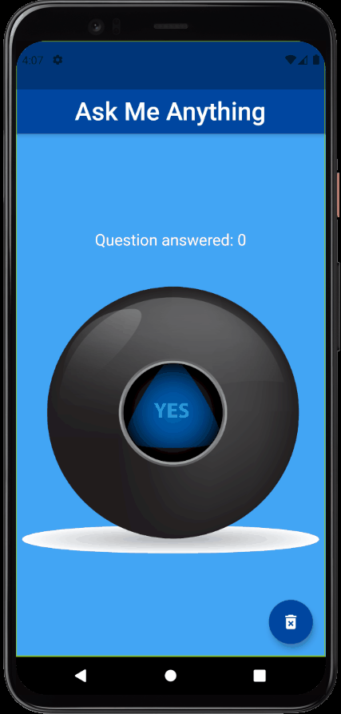

# Magic ball App - [](https://flutter.dev/)

<h1 align="center">
  
  <p>A Flutter App to "ask questions"</p>
  
</h1>

# Features

- Single page where you can think in a question and click the "magic ball"
- It counts how many question you had and you can go set 'answers' back to zero again

## Getting Started

- Clone the repository
- run in cmd:
  ```cmd
  flutter pub get
  flutter run
  ```

## Dependencieis

| Lib | Link              |
| --- | ----------------- |
| No  | [No dependency]() |

## Device

- Tested in Pixel 4 - Android 11
